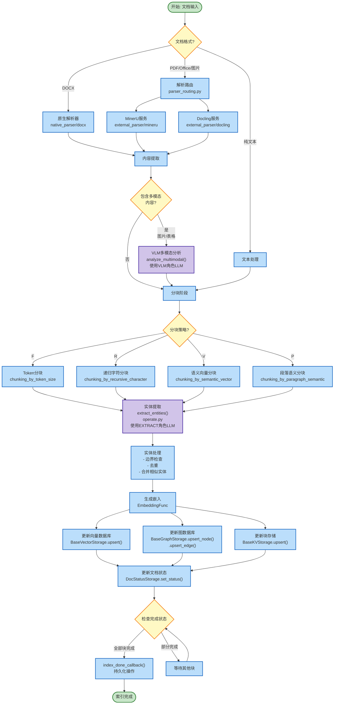
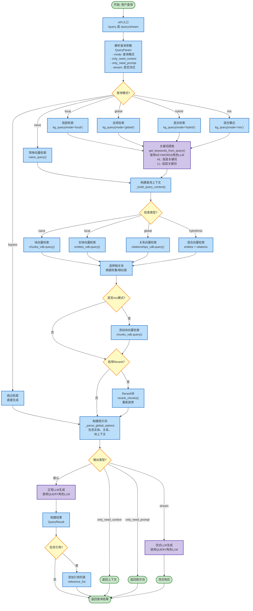
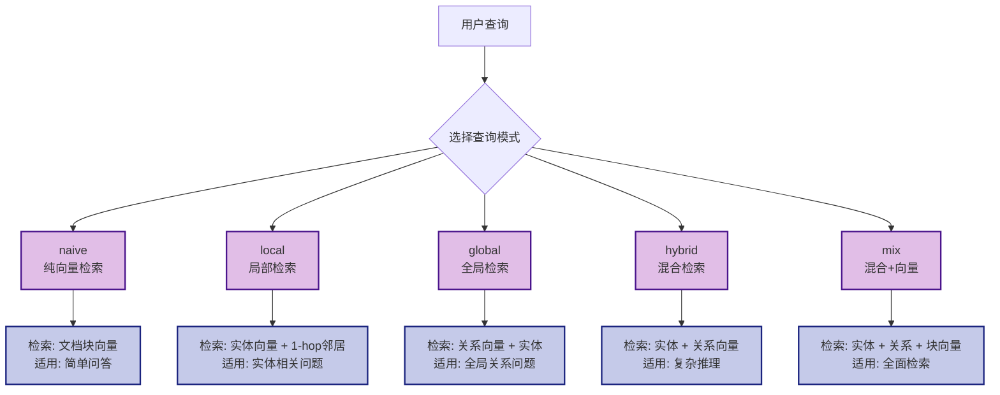
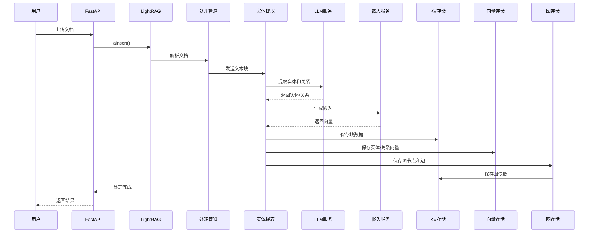
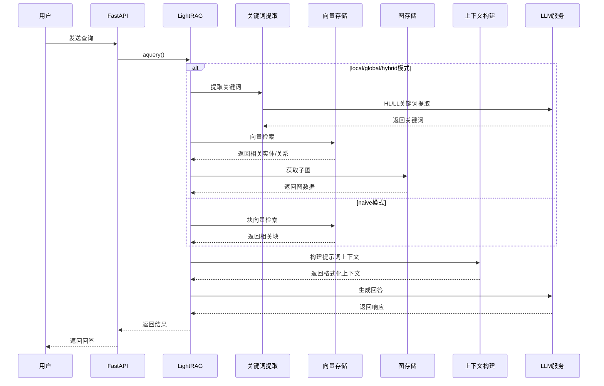
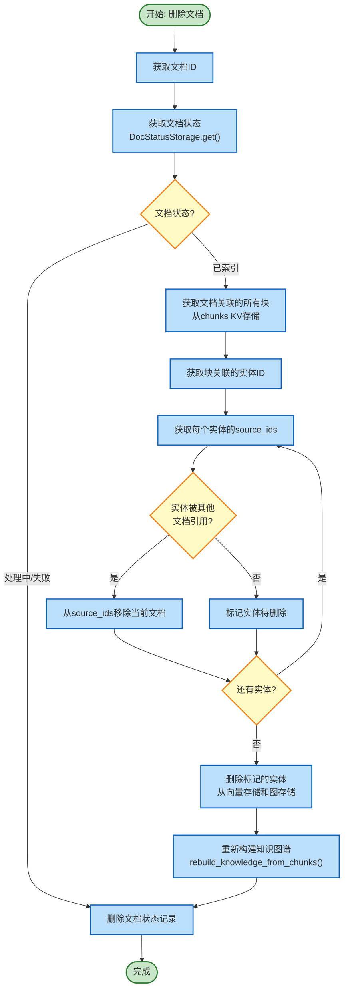

# LightRAG 流程图

本文档展示 LightRAG 的核心处理流程，包括文档索引流程和查询流程。

---

## 1. 文档索引流程

从文档输入到知识图谱构建的完整流程：

---

## 2. 查询流程

从用户查询到返回结果的完整流程：

---

## 3. 查询模式详解

---

## 4. 存储交互流程

---

## 5. 查询交互流程

---

## 6. 文档删除流程

---

## 关键处理阶段说明

### 索引流程关键点

1. **文档解析**: 支持原生解析(DOCX)和外部服务解析(MinerU/Docling)
2. **多模态处理**: VLM分析图片、表格等非文本内容
3. **分块策略**: 四种策略可选，适应不同文档类型
4. **实体提取**: LLM提取实体和关系，构建知识图谱
5. **并行处理**: 支持多块并行处理，提高效率

### 查询流程关键点

1. **查询模式**: 六种模式适应不同查询需求
2. **关键词提取**: 分为高层(HL)和低层(LL)关键词
3. **向量检索**: 基于嵌入相似度检索相关内容
4. **图遍历**: 获取相关实体的邻居信息
5. **Rerank**: 可选的重排序提高检索精度
6. **上下文构建**: 整合检索结果构建完整上下文
7. **LLM生成**: 基于上下文生成最终回答

### LLM 角色

LightRAG 为不同处理阶段使用专门的 LLM 配置：

| 角色 | 用途 | 配置参数 |
|-----|------|---------|
| EXTRACT | 实体和关系提取 | `EXTRACT_MODEL` |
| QUERY | 查询响应生成 | `QUERY_MODEL` |
| KEYWORDS | 关键词提取 | `KEYWORDS_MODEL` |
| VLM | 多模态内容分析 | `VLM_MODEL` |
