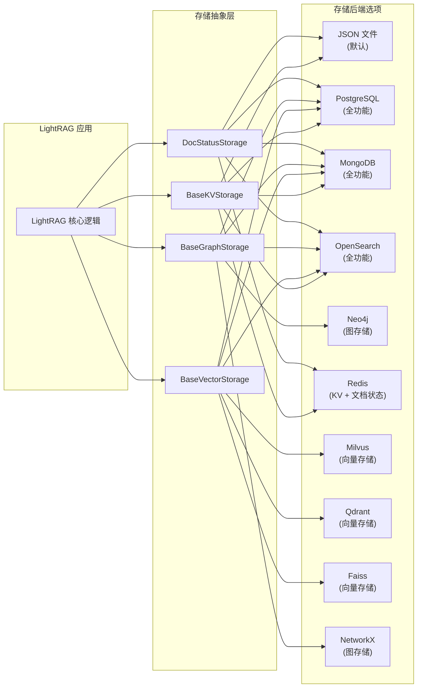
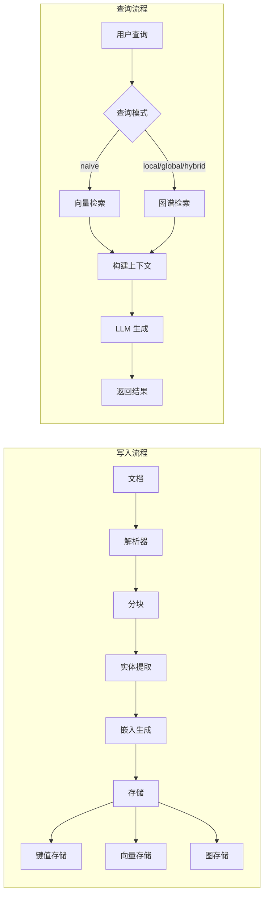

# LightRAG 项目架构图

## 项目概述

LightRAG 是一个基于知识图谱的检索增强生成(RAG)框架，采用分层架构设计，支持多种存储后端、LLM提供商和文档解析策略。

---

## 分层架构

```mermaid
graph TB
    subgraph "API Layer - API层"
        API["FastAPI Server<br/>lightrag/api/"]
        QueryRouter["/query Routes<br/>query_routes.py"]
        DocRouter["/documents Routes<br/>document_routes.py"]
        GraphRouter["/graph Routes<br/>graph_routes.py"]
        OllamaAPI["Ollama Compatible API<br/>ollama_api.py"]
        Auth["Authentication<br/>auth.py"]

        API --> QueryRouter
        API --> DocRouter
        API --> GraphRouter
        API --> OllamaAPI
        API --> Auth
    end

    subgraph "Core Layer - 核心层"
        LightRAG["LightRAG Main Class<br/>lightrag.py"]
        RoleConfig["Role LLM Config<br/>llm_roles.py"]
        Namespace["Namespace Management<br/>namespace.py"]
        StorageMigration["Storage Migration<br/>storage_migrations.py"]

        LightRAG --> RoleConfig
        LightRAG --> Namespace
        LightRAG --> StorageMigration
    end

    subgraph "Pipeline Layer - 管道层"
        Pipeline["_PipelineMixin<br/>pipeline.py"]
        ParseRouting["Parser Routing<br/>parser_routing.py"]

        Pipeline --> ParseRouting
    end

    subgraph "Operation Layer - 操作层"
        Operate["Operate Module<br/>operate.py"]
        ExtractEntities["extract_entities()<br/>实体提取"]
        KGQuery["kg_query()<br/>知识图谱查询"]
        NaiveQuery["naive_query()<br/>简单向量查询"]
        MergeNodes["merge_nodes_and_edges()<br/>节点合并"]

        Operate --> ExtractEntities
        Operate --> KGQuery
        Operate --> NaiveQuery
        Operate --> MergeNodes
    end

    subgraph "Storage Layer - 存储层"
        StorageFactory["Storage Factory<br/>kg/factory.py"]

        subgraph "Storage Abstractions - 存储抽象"
            BaseKV["BaseKVStorage<br/>键值存储抽象"]
            BaseVector["BaseVectorStorage<br/>向量存储抽象"]
            BaseGraph["BaseGraphStorage<br/>图存储抽象"]
            BaseDocStatus["DocStatusStorage<br/>文档状态存储"]
        end

        subgraph "KV Storage Implementations - 键值存储实现"
            JsonKV["JsonKVStorage"]
            RedisKV["RedisKVStorage"]
            PGKV["PGKVStorage"]
            MongoKV["MongoKVStorage"]
            OpenSearchKV["OpenSearchKVStorage"]
        end

        subgraph "Vector Storage Implementations - 向量存储实现"
            NanoVector["NanoVectorDBStorage"]
            MilvusVector["MilvusVectorDBStorage"]
            PGVector["PGVectorStorage"]
            FaissVector["FaissVectorDBStorage"]
            QdrantVector["QdrantVectorDBStorage"]
            MongoVector["MongoVectorDBStorage"]
            OpenSearchVector["OpenSearchVectorDBStorage"]
        end

        subgraph "Graph Storage Implementations - 图存储实现"
            NetworkX["NetworkXStorage"]
            Neo4J["Neo4JStorage"]
            PGGraph["PGGraphStorage"]
            MongoGraph["MongoGraphStorage"]
            Memgraph["MemgraphStorage"]
            OpenSearchGraph["OpenSearchGraphStorage"]
        end

        subgraph "Doc Status Implementations - 文档状态存储实现"
            JsonDocStatus["JsonDocStatusStorage"]
            RedisDocStatus["RedisDocStatusStorage"]
            PGDocStatus["PGDocStatusStorage"]
            MongoDocStatus["MongoDocStatusStorage"]
            OpenSearchDocStatus["OpenSearchDocStatusStorage"]
        end

        StorageFactory --> BaseKV
        StorageFactory --> BaseVector
        StorageFactory --> BaseGraph
        StorageFactory --> BaseDocStatus

        BaseKV --> JsonKV
        BaseKV --> RedisKV
        BaseKV --> PGKV
        BaseKV --> MongoKV
        BaseKV --> OpenSearchKV

        BaseVector --> NanoVector
        BaseVector --> MilvusVector
        BaseVector --> PGVector
        BaseVector --> FaissVector
        BaseVector --> QdrantVector
        BaseVector --> MongoVector
        BaseVector --> OpenSearchVector

        BaseGraph --> NetworkX
        BaseGraph --> Neo4J
        BaseGraph --> PGGraph
        BaseGraph --> MongoGraph
        BaseGraph --> Memgraph
        BaseGraph --> OpenSearchGraph

        BaseDocStatus --> JsonDocStatus
        BaseDocStatus --> RedisDocStatus
        BaseDocStatus --> PGDocStatus
        BaseDocStatus --> MongoDocStatus
        BaseDocStatus --> OpenSearchDocStatus
    end

    subgraph "LLM Layer - LLM层"
        LLMModule["LLM Module<br/>llm/"]
        OpenAI["OpenAI"]
        Azure["Azure OpenAI"]
        Gemini["Gemini"]
        Anthropic["Anthropic"]
        Ollama["Ollama"]
        HF["HuggingFace"]
        Bedrock["Bedrock"]
        Jina["Jina"]

        LLMModule --> OpenAI
        LLMModule --> Azure
        LLMModule --> Gemini
        LLMModule --> Anthropic
        LLMModule --> Ollama
        LLMModule --> HF
        LLMModule --> Bedrock
        LLMModule --> Jina
    end

    subgraph "Parser Layer - 解析层"
        Chunker["Chunker Module<br/>chunker/"]
        TokenSize["Token Size<br/>(F策略)"]
        RecursiveChar["Recursive Character<br/>(R策略)"]
        SemanticVector["Semantic Vector<br/>(V策略)"]
        ParagraphSemantic["Paragraph Semantic<br/>(P策略)"]

        ExternalParser["External Parser<br/>external_parser/"]
        NativeParser["Native Parser<br/>native_parser/"]
        MinerU["MinerU Client"]
        Docling["Docling Client"]

        Chunker --> TokenSize
        Chunker --> RecursiveChar
        Chunker --> SemanticVector
        Chunker --> ParagraphSemantic

        ExternalParser --> MinerU
        ExternalParser --> Docling
    end

    subgraph "Utils & Support - 工具支持层"
        Utils["Utils<br/>utils.py"]
        EmbeddingFunc["EmbeddingFunc"]
        Tokenizer["Tokenizer"]
        Cache["Cache Management"]

        Prompt["Prompt Module<br/>prompt.py"]
        PromptTemplates["Prompt Templates"]

        Constants["Constants<br/>constants.py"]

        Evaluation["Evaluation<br/>evaluation/"]

        Utils --> EmbeddingFunc
        Utils --> Tokenizer
        Utils --> Cache
        Prompt --> PromptTemplates
    end

    %% API to Core connections
    QueryRouter --> LightRAG
    DocRouter --> LightRAG
    GraphRouter --> LightRAG
    OllamaAPI --> LightRAG

    %% Core to Pipeline connections
    LightRAG --> Pipeline
    LightRAG --> Operate

    %% Core to Storage connections
    LightRAG --> StorageFactory
    Operate -.-> BaseKV
    Operate -.-> BaseVector
    Operate -.-> BaseGraph
    Pipeline -.-> BaseDocStatus

    %% Core to LLM connections
    LightRAG --> LLMModule
    Operate -.-> LLMModule

    %% Pipeline to Parser connections
    Pipeline --> Chunker
    Pipeline --> ExternalParser
    Pipeline --> NativeParser

    %% Support connections
    LightRAG --> Utils
    Operate --> Prompt
    LightRAG --> Constants
    LightRAG --> Evaluation

    classDef apiClass fill:#e1f5fe,stroke:#01579b,stroke-width:2px
    classDef coreClass fill:#f3e5f5,stroke:#4a148c,stroke-width:2px
    classDef pipelineClass fill:#e8f5e9,stroke:#1b5e20,stroke-width:2px
    classDef operationClass fill:#fff3e0,stroke:#e65100,stroke-width:2px
    classDef storageClass fill:#fce4ec,stroke:#880e4f,stroke-width:2px
    classDef llmClass fill:#fff9c4,stroke:#f57f17,stroke-width:2px
    classDef parserClass fill:#e0f2f1,stroke:#004d40,stroke-width:2px
    classDef utilsClass fill:#f1f8e9,stroke:#33691e,stroke-width:2px

    class API,QueryRouter,DocRouter,GraphRouter,OllamaAPI,Auth apiClass
    class LightRAG,RoleConfig,Namespace,StorageMigration coreClass
    class Pipeline,ParseRouting pipelineClass
    class Operate,ExtractEntities,KGQuery,NaiveQuery,MergeNodes operationClass
    class StorageFactory,BaseKV,BaseVector,BaseGraph,BaseDocStatus,JsonKV,RedisKV,PGKV,MongoKV,OpenSearchKV,NanoVector,MilvusVector,PGVector,FaissVector,QdrantVector,MongoVector,OpenSearchVector,NetworkX,Neo4J,PGGraph,MongoGraph,Memgraph,OpenSearchGraph,JsonDocStatus,RedisDocStatus,PGDocStatus,MongoDocStatus,OpenSearchDocStatus storageClass
    class LLMModule,OpenAI,Azure,Gemini,Anthropic,Ollama,HF,Bedrock,Jina llmClass
    class Chunker,TokenSize,RecursiveChar,SemanticVector,ParagraphSemantic,ExternalParser,NativeParser,MinerU,Docling parserClass
    class Utils,EmbeddingFunc,Tokenizer,Cache,Prompt,PromptTemplates,Constants,Evaluation utilsClass
```



---

## 架构层次说明

### 1. API 层 (API Layer)
- **FastAPI Server**: 主服务器入口
- **路由组件**: 提供 `/query`、`/documents`、`/graph` 等 REST API 接口
- **Ollama 兼容 API**: 允许与 Ollama 客户端集成
- **认证**: 用户身份验证和授权

### 2. 核心层 (Core Layer)
- **LightRAG 主类**: 协调所有模块的核心类
- **角色 LLM 配置**: 支持不同角色使用不同 LLM (EXTRACT, QUERY, KEYWORDS, VLM)
- **命名空间管理**: 多租户数据隔离
- **存储迁移**: 版本升级时的数据迁移支持

### 3. 管道层 (Pipeline Layer)
- **文档处理管道**: 异步文档处理流程
- **解析器路由**: 根据文档格式选择合适的解析器

### 4. 操作层 (Operation Layer)
- **实体提取**: 从文档中提取实体和关系
- **知识图谱查询**: 基于图谱的检索
- **简单向量查询**: 纯向量检索
- **节点合并**: 合并相似实体和关系

### 5. 存储层 (Storage Layer)
提供了四个存储抽象基类，支持多种后端实现：

| 存储类型 | 抽象基类 | 支持的后端 |
|---------|---------|-----------|
| 键值存储 | BaseKVStorage | JSON, Redis, PostgreSQL, MongoDB, OpenSearch |
| 向量存储 | BaseVectorStorage | NanoVectorDB, Milvus, PostgreSQL, Faiss, Qdrant, MongoDB, OpenSearch |
| 图存储 | BaseGraphStorage | NetworkX, Neo4j, PostgreSQL, MongoDB, Memgraph, OpenSearch |
| 文档状态 | DocStatusStorage | JSON, Redis, PostgreSQL, MongoDB, OpenSearch |

### 6. LLM 层 (LLM Layer)
集成多种 LLM 提供商：
- OpenAI / Azure OpenAI
- Google Gemini
- Anthropic Claude
- Ollama (本地部署)
- HuggingFace
- AWS Bedrock
- Jina

### 7. 解析层 (Parser Layer)
- **分块策略**:
  - **F (Fix)**: Token 大小固定分块
  - **R (Recursive)**: 递归字符分块
  - **V (Vector)**: 语义向量分块
  - **P (Paragraph)**: 段落语义分块

- **外部解析服务**:
  - **MinerU**: 多模态文档解析
  - **Docling**: 文档解析服务

### 8. 工具支持层 (Utils & Support)
- **嵌入函数**: 文本向量化
- **分词器**: 文本分词
- **缓存管理**: LLM 响应缓存
- **提示词模板**: 可定制的提示词
- **评估工具**: RAG 质量评估

---

## 核心设计模式

1. **工厂模式**: StorageFactory 根据配置创建存储实例
2. **策略模式**: 支持多种分块策略和查询模式
3. **适配器模式**: 统一的存储抽象接口适配多种后端
4. **管道模式**: 文档处理流程分阶段执行
5. **角色模式**: 不同处理阶段使用不同 LLM 配置

---

## 存储架构



---

## 数据流向



---

## 默认存储结构

### Working Directory 文件组织

LightRAG 默认在 `working_dir`（如 `./rag_storage_v2`）下创建以下文件：

```
working_dir/
├── graph_chunk_entity_relation.graphml    # 知识图谱
├── kv_store_full_docs.json                # 完整文档存储
├── kv_store_text_chunks.json              # 文本分块存储
├── kv_store_full_entities.json            # 实体信息存储
├── kv_store_full_relations.json           # 关系信息存储
├── kv_store_entity_chunks.json            # 实体相关分块存储
├── kv_store_relation_chunks.json          # 关系相关分块存储
├── kv_store_doc_status.json               # 文档处理状态存储
├── kv_store_llm_response_cache.json       # LLM响应缓存
├── vdb_chunks.json                        # 文本分块向量存储
├── vdb_entities.json                      # 实体向量存储
└── vdb_relationships.json                 # 关系向量存储
```

### 文件说明

#### 知识图谱

| 文件 | 格式 | 内容 |
|------|------|------|
| `graph_chunk_entity_relation.graphml` | GraphML | 节点(实体) + 边(关系)，含属性和元数据 |

#### Key-Value 存储 (JsonKVStorage)

| 文件 | 存储内容 |
|------|----------|
| `kv_store_full_docs.json` | 原始文档内容，以 doc_id 为键 |
| `kv_store_text_chunks.json` | 文本分块，含 content、tokens、chunk_order_index |
| `kv_store_full_entities.json` | 实体列表和元数据（count、create_time、update_time） |
| `kv_store_full_relations.json` | 实体间关系描述 |
| `kv_store_entity_chunks.json` | 与实体相关的文本分块映射 |
| `kv_store_relation_chunks.json` | 与关系相关的文本分块映射 |
| `kv_store_doc_status.json` | 文档处理状态（pending/processed/failed） |
| `kv_store_llm_response_cache.json` | LLM 响应缓存，避免重复请求 |

#### 向量存储 (NanoVectorDBStorage)

| 文件 | 存储内容 |
|------|----------|
| `vdb_chunks.json` | 文本分块的 embedding 向量，用于语义搜索 |
| `vdb_entities.json` | 实体的 embedding 向量，用于实体相似度检索 |
| `vdb_relationships.json` | 关系的 embedding 向量，用于关系相似度检索 |

### 默认存储后端

| 存储类型 | 默认实现 | 替代方案 |
|----------|----------|----------|
| KV Storage | `JsonKVStorage` | Redis, PostgreSQL, MongoDB, OpenSearch |
| Vector Storage | `NanoVectorDBStorage` | Milvus, Qdrant, Faiss, PostgreSQL, MongoDB |
| Graph Storage | `NetworkXStorage` | Neo4j, PostgreSQL, MongoDB, Memgraph |
| Doc Status | `JsonDocStatusStorage` | Redis, PostgreSQL, MongoDB, OpenSearch |
